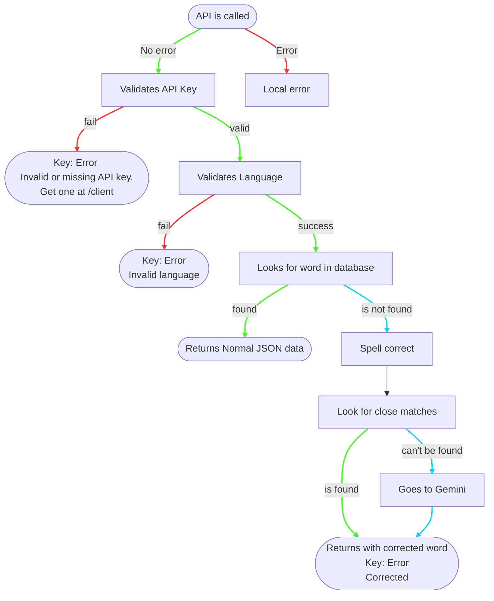

<div align="center"> 


<br/><br/>

[](/)
[](/)
[](/)

<br/>

**Definitions · Synonyms · Antonyms · Part of Speech — in one free API call.**

<br/>

[Get a Key](#-getting-started) · [Try It](#-your-first-request) · [Response Format](#-response-format) · [Errors](#-errors)

</div>

---

## 🚀 Getting Started

<details>
<summary><b>Step 1 — Get your free API key</b></summary>
<br/>

Visit **`/client`** and fill in your name and email. Your key arrives in your inbox within seconds.

> **Your key looks like this:** `oa_f360fb6fe04b1be5b109e9`
>
> 25 characters · always starts with `oa_` · one per email · always free.

</details>

<details>
<summary><b>Step 2 — Make your first request</b></summary>
<br/>

```
GET /api/{your_key}/eng/{word}
```

```bash
curl https://yourhost/api/oa_f367fb6fe04b1be5b129e9/eng/eloquent
```

</details>

---

## 📖 Response Format

```json
{
  "word": "eloquent",
  "lang": "eng",
  "results": [
    {
      "definition": "Having the power of expressing strong emotions or arguments in a fluent and convincing way.",
      "pos": "adj",
      "pos_name": "Adjective",
      "synonyms": "fluent, expressive, articulate",
      "antonyms": "inarticulate, silent"
    }
  ],
  "error": null
}
```

> A word can return **multiple results** if it has more than one meaning. Each result is a separate object in the `results` array.

---

## ✏️ Spell Correction

Misspelled a word? The API detects it automatically and returns the closest match. The corrected spelling appears in the `"word"` field so you always know what was looked up.


---

## 📡 Endpoints

| Method | Route | What it does |
|:------:|-------|-------------|
| `GET` | `/api/{key}/eng/{word}` | Look up a word |
| `POST` | `/generate-key` | Get a new API key |
| `POST` | `/lookup-key` | Check who a key belongs to |
| `POST` | `/feedback` | Send feedback |

---

## ⚠️ Errors

| Status | Symbol | Meaning | Fix |
|:------:|:------:|---------|-----|
| `401` | 🔒 | Invalid API key | Copy your key exactly from the email |
| `500` | 💥 | Server error | Try again or contact us |

---

## 🔑 Key Management

<details>
<summary><b>Lost your key?</b></summary>
<br/>

Go to **`/client`** and enter the **same email** you registered with. Your original key is resent — a new one is never generated for an existing email.

</details>

<details>
<summary><b>Verify a key</b></summary>
<br/>

Use the **Look Up Your Key** panel on `/client`. Enter any `oa_` key to see the name and masked email it was registered to.

</details>

---

## 💬 Feedback

Something broken or a word missing? Open **`/client`**, scroll to the feedback form, leave a rating and a message. Email is optional but helps us follow up.

---

## 📋 Quick Reference

| | |
|---|---|
| **Base URL** | `/api/{key}/eng/{word}` |
| **Language** | `eng` (English) |
| **Key format** | `oa_` + 22 hex chars = 25 total |
| **Key cost** | Free |
| **Keys per email** | 1 |
| **Response format** | JSON |
| **Spell correction** | Automatic |

---

<div align="center">

[](https://github.com/Robotics-now/Dictionary_api)

</div>

## License

> **Source-Available · Limited Use License**
> Copyright © 2026 Aditya Raj and Pratyush Raj

This license governs use of the software and associated documentation files (the "Software") in this repository. The Software is provided for educational and personal review purposes only.

---

### ✅ Granted Rights

- Download and view the source code on your local machine
- Compile and run the Software for private, non-commercial, personal projects

### ❌ Restrictions

No written permission from the copyright holder? Then the following are **strictly prohibited**:

- **No Redistribution** — You may not share, host, mirror, or redistribute the source code or compiled binaries in any form
- **No Commercial Use** — You may not use the Software for any commercial purpose, including selling it or using it within a commercial entity
- **No Derivative Works** — You may not modify the Software and distribute those modifications as a separate project

---

### ⚠️ Termination

This license terminates automatically if you breach any of these terms. Upon termination, you must destroy all copies of the Software in your possession.

---

### Disclaimer of Warranty

THE SOFTWARE IS PROVIDED "AS IS", WITHOUT WARRANTY OF ANY KIND, EXPRESS OR IMPLIED, INCLUDING BUT NOT LIMITED TO THE WARRANTIES OF MERCHANTABILITY, FITNESS FOR A PARTICULAR PURPOSE AND NONINFRINGEMENT. IN NO EVENT SHALL THE AUTHORS OR COPYRIGHT HOLDERS BE LIABLE FOR ANY CLAIM, DAMAGES OR OTHER LIABILITY ARISING FROM, OUT OF OR IN CONNECTION WITH THE SOFTWARE OR ITS USE.

---

*For permissions beyond the scope of this license, contact the copyright holder.*
